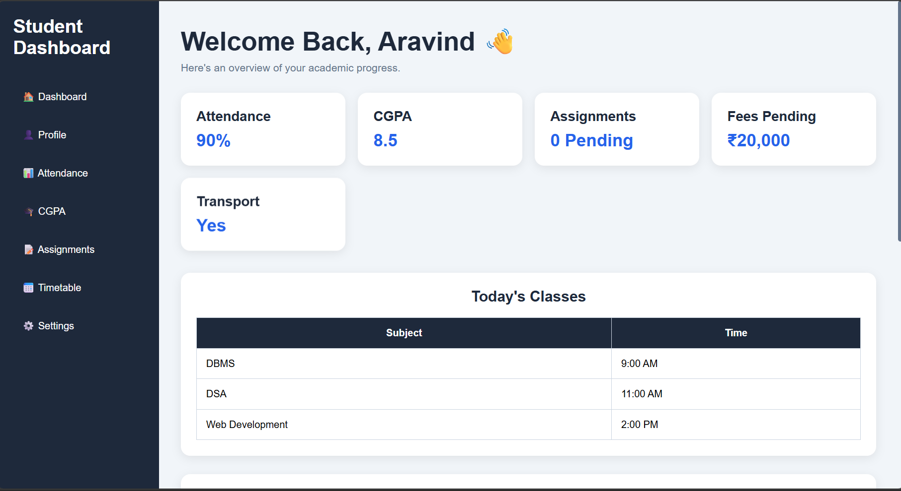
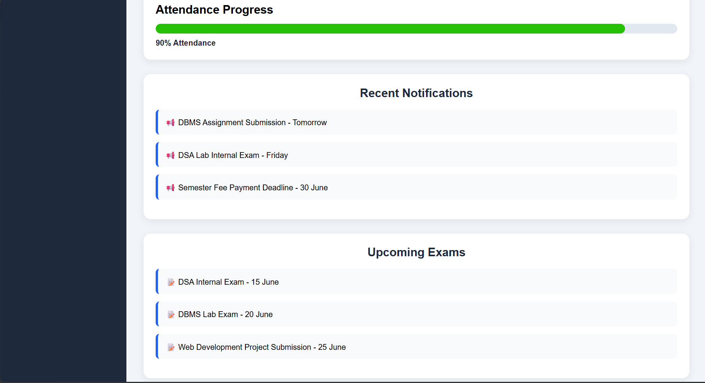

# 🎓 Student Dashboard

A simple and responsive Student Dashboard built using HTML and CSS.

## Features

- 📌 Sidebar Navigation
- 👋 Welcome Section
- 📊 Student Statistics Cards
- 📅 Timetable Section
- 🔔 Notifications Section
- 📈 Attendance Progress Bar
- 🎨 Clean and Modern UI
- 📱 Responsive Design

## Technologies Used

- HTML5
- CSS3
- Flexbox
- CSS Grid

## Project Structure

```
Student-Dashboard/
│
├── index.html
├── style.css
├── README.md
│
└── output/
    ├── 1.png
    └── 2.png
```

## Output

### Dashboard View 1



### Dashboard View 2



## Future Improvements

- Add JavaScript Functionality
- Hamburger Menu
- Dark Mode
- Dynamic Attendance Tracking
- Student Login System
- Database Integration

## Author

**Aravind**

B.Tech CSE Student  
Web Development Enthusiast